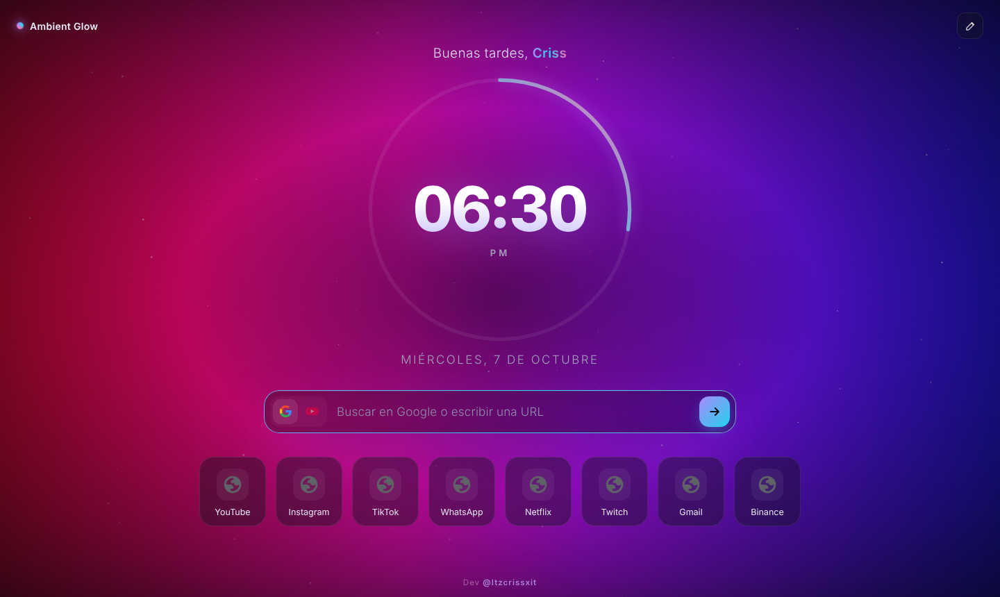
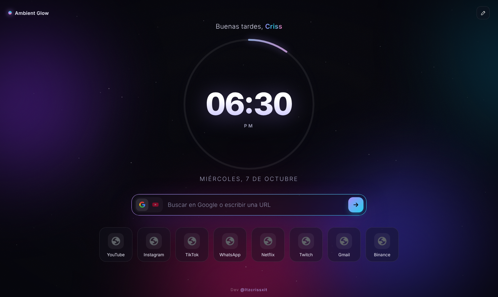
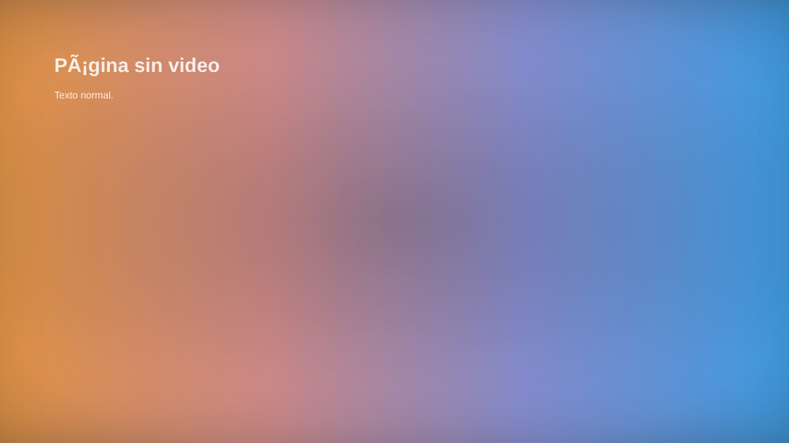

<div align="center">


# Ambient Glow Everywhere

**Luz ambiental para todo Chrome.** El color de tu video ilumina todas tus pestañas.

  

Dev **[@Itzcrissxit](https://itzcrissxit.com)**



</div>

---

## ✨ Qué hace

| | |
|---|---|
| 🎵 **Colores sincronizados** | Pones música o un video en una pestaña, pulsas un botón, y WhatsApp, Instagram, Google… todas se iluminan con los colores de ese video en tiempo real. |
| 🎬 **Ambilight en cualquier video** | Twitch, Kick, X, Instagram, Reddit… el brillo sale alrededor del video, como en una TV Ambilight. |
| 🌌 **Nueva pestaña propia** | Aurora animada, reloj con anillo de segundos, buscador Google/YouTube y accesos editables. |
| 🌈 **Modo RGB** | En páginas sin video, un borde de luz RGB animado tipo tira LED. |
| 🎛️ **Todo ajustable** | Intensidad, desenfoque, saturación, brillo, FPS, oscurecer página, apagar por sitio. |
| 🖥️ **Pantalla completa real** | Pausa la captura un instante para que la pantalla completa del video funcione normal. |

<p align="center">
  
  
</p>

## 🚀 Instalar

1. Descarga este repositorio (**Code → Download ZIP**) y descomprímelo.
2. Abre `chrome://extensions` y activa **Modo de desarrollador**.
3. Pulsa **Cargar descomprimida** y elige la carpeta **`extension`**.
4. Fija **Ambient Glow** en la barra (icono 🧩).

## 🎵 Usar los colores de un video en todas las pestañas

1. Abre un video (YouTube, Twitch…) y dale play.
2. Pulsa el icono de Ambient Glow → **🎵 Usar los colores de esta pestaña en todas**.
3. Cambia de pestaña: todo se ilumina con los colores del video.
4. Para parar: **⏹ Detener sincronización**.

## ⚠️ Límites

- Netflix, Disney+, Prime Video y Max bloquean la imagen (DRM): ahí no hay colores.
- Las páginas internas de Chrome (`chrome://`) y la Chrome Web Store no se pueden modificar.
- Se ve mejor en páginas con tema oscuro.

## 🧩 Cómo funciona

```
extension/
├── manifest.json     Manifest V3
├── content.js        Dibuja el brillo en cada página (video local, colores sincronizados o RGB)
├── background.js     Coordina la sincronización entre pestañas
├── offscreen.js      Lee la pestaña elegida y saca una miniatura de 16×9 colores ~15 veces/seg
├── fs-main.js        Pausa la captura antes de la pantalla completa
├── newtab.*          Nueva pestaña
└── popup.*           Menú de ajustes
```

Todo corre en tu navegador: no se envía nada a ningún servidor.

## 📄 Licencia

MIT © 2026 [@Itzcrissxit](https://itzcrissxit.com)
